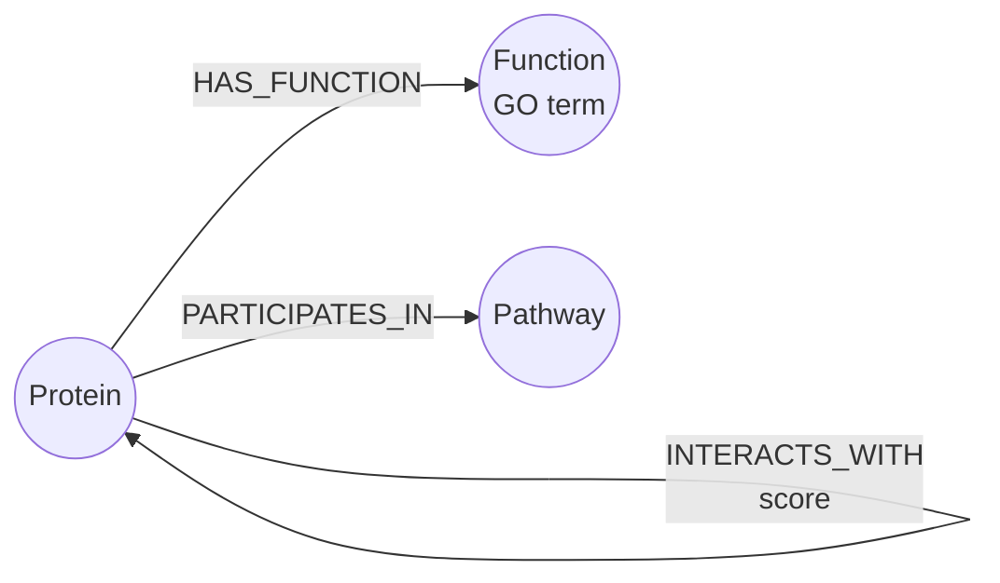

# Knowledge-Grounded Question Answering over a Protein Interaction Graph (PaxDB)

This project builds a small knowledge graph from bacterial proteomics data
(PaxDB) to explore **knowledge-grounded reasoning over structured biological
data**. Proteins, molecular functions, and pathways are modelled as nodes and
relationships in Neo4j. A lightweight LLM layer translates natural-language
questions into Cypher queries, retrieves the relevant graph paths, and answers
based on that retrieved evidence — with the underlying query and rows shown
alongside every answer for traceability. The goal is to show how graph-grounded
retrieval can make LLM outputs in biomedical/scientific settings more
interpretable and verifiable.

The organism is *Escherichia coli* K-12 (NCBI taxid **511145**), the
best-annotated model bacterium. The graph is deliberately scoped to the
**200 most-abundant proteins** so it stays small and legible.

---

## Why this design

The data forms one coherent story keyed on a **single identifier** — the STRING
protein id (e.g. `511145.b3495`):

| Source | Gives us | Becomes |
|--------|----------|---------|
| **PaxDB** (abundance pipeline) | the protein subset + abundance | `:Protein` nodes |
| **STRING** (`protein.links`) | protein–protein interactions | `:INTERACTS_WITH` |
| **UniProt** (id-mapping) | GO molecular-function terms | `:HAS_FUNCTION` → `:Function` |
| **UniProt** (id-mapping) | curated pathway names | `:PARTICIPATES_IN` → `:Pathway` |

Because PaxDB abundance files are already keyed by STRING ids, STRING
interactions drop in with **no id translation**, and UniProt id-mapping supplies
the functional layer. This is the "multimodal integration" the graph is meant to
demonstrate: structured abundance + interaction topology + functional
annotation, unified in one queryable graph.

---

## Schema



**Nodes**

- `(:Protein {string_id, gene_name, protein_name, abundance, abundance_rank, uniprot})`
- `(:Function {go_id, name})` — GO molecular-function terms
- `(:Pathway {name})` — curated UniProt pathway names

**Relationships**

- `(:Protein)-[:INTERACTS_WITH {score}]->(:Protein)` — STRING, high-confidence (score ≥ 0.7), treated as undirected
- `(:Protein)-[:HAS_FUNCTION]->(:Function)`
- `(:Protein)-[:PARTICIPATES_IN]->(:Pathway)`

Current graph (default build): **200 proteins, 242 functions, 93 pathways,
2,806 interactions, 645 function edges, 152 pathway edges.**

---

## Setup

Prerequisites: Python 3.10+, a running Neo4j 5/2026 instance, and the PaxDB
abundance CSV produced by the upstream pipeline (path set in `config.py` /
`.env`).

```bash
# 1. Install Neo4j (macOS example) and start it
brew install neo4j
neo4j-admin dbms set-initial-password thesisgraph123
neo4j start                     # browser UI at http://localhost:7474

# 2. Python environment
python3 -m venv venv
source venv/bin/activate
pip install -r requirements.txt

# 3. Configure
cp .env.example .env            # edit if your Neo4j password differs

# 4. Build the data tables, then load them into Neo4j
python src/build_dataset.py     # PaxDB subset + STRING + UniProt  -> data/*.csv
python src/load_graph.py        # wipe + load into Neo4j
```

`setup.sh` runs steps 2–4 in one go once Neo4j is up.

---

## Usage

**Run the six example Cypher queries:**

```bash
python src/run_queries.py
```

**Ask the graph a natural-language question:**

```bash
python src/ask.py "what does gapA interact with?"
python src/ask.py               # interactive
```

---

## The reasoning layer (NL → Cypher → grounded answer)

`src/ask.py` implements the retrieval loop:

1. **Translate** the question to a single read-only Cypher query.
2. **Execute** it against Neo4j (a write-token guard refuses anything that isn't read-only).
3. **Show the evidence** — the exact query and the exact rows returned.
4. **Answer** in prose grounded *only* in those rows.

The translation step is a **pluggable backend** (`src/nl2cypher.py`), chosen by
the `LLM_BACKEND` env var — so the same pipeline runs with no GPU/key today and
upgrades to an LLM later without touching the rest of the code:

| `LLM_BACKEND` | How it translates | Needs |
|---------------|-------------------|-------|
| `template` *(default)* | rule-based intent matcher; entity names grounded in the graph's own gene vocabulary | nothing — no key, no GPU |
| `anthropic` | Claude translates NL → Cypher | `ANTHROPIC_API_KEY` |
| `ollama` | a local open model (e.g. llama3.1) | Ollama running locally |

This makes the project reproducible on any machine while keeping the LLM path a
one-line switch.

---

## Example grounded Q&A

**Q: "What does gapA interact with?"**

```
[backend] template:interaction_partners
[cypher]
    MATCH (p:Protein {gene_name: 'gapA'})-[e:INTERACTS_WITH]-(o:Protein)
    RETURN o.gene_name AS partner, o.protein_name AS name, e.score AS score
    ORDER BY score DESC LIMIT 25
[evidence] 22 rows: pgk (0.999), tpiA (0.999), fbaA (0.997), eno (0.993), mdh (0.98), ...
[answer]  gapA's highest-confidence partners are the glycolytic enzymes pgk,
          tpiA, fbaA and eno — exactly the neighbouring steps in glycolysis.
```

**Q: "How are rplL and gapA connected?"**

```
[backend] template:shortest_path
[cypher]
    MATCH path = shortestPath((a:Protein {gene_name:'rplL'})
      -[:INTERACTS_WITH*..6]-(b:Protein {gene_name:'gapA'}))
    RETURN [n IN nodes(path) | n.gene_name] AS path, length(path) AS hops
[evidence] 1 row: path=[rplL, rpoA, gapA], hops=2
[answer]  They are two interaction hops apart, bridged by rpoA (RNA polymerase
          subunit alpha).
```

Every answer is traceable: the Cypher and the retrieved rows *are* the citation.

---

## Repository layout

```
config.py              connection + build settings (reads .env)
src/build_dataset.py   PaxDB subset + STRING interactions + UniProt annotation -> data/*.csv
src/load_graph.py      load the CSV tables into Neo4j (idempotent MERGE)
src/queries.cypher     the six example queries (also runnable in Neo4j Browser)
src/run_queries.py     run all example queries and print result tables
src/nl2cypher.py       pluggable NL -> Cypher backends (template / anthropic / ollama)
src/ask.py             NL question -> Cypher -> grounded, traceable answer
data/*.csv             the built node/edge tables
```

---

## Data sources

- **PaxDB** — protein abundance. Wang et al., *Proteomics* (2015). https://pax-db.org
- **STRING** — protein–protein interactions. Szklarczyk et al., *NAR* (2023). https://string-db.org
- **UniProt** — functional annotation (GO, pathways). https://www.uniprot.org
